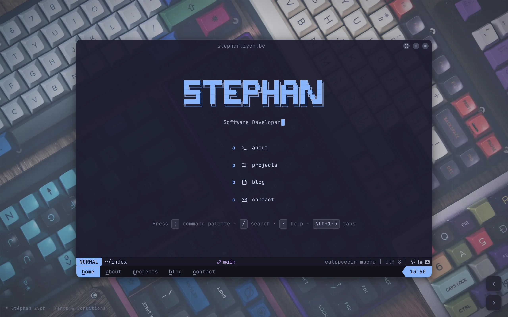
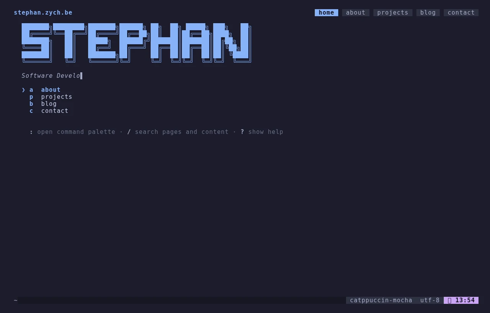

# stephan.zych.be

A personal technical space — engineering notes & experiments — styled as a
terminal environment, in two flavours that share one content source:

- **`web/`** — a static site (Eleventy + Lit + TypeScript), served by Caddy (or GitHub Pages).
- **`tui/`** — a real terminal version served over SSH (Go + Charm: Wish · Bubble Tea · Glamour).
- **`content/`** — the markdown corpus (blog, projects, pages) both front-ends read.

## Preview

| Web (Eleventy) | Terminal (SSH) |
|----------------|----------------|
| [](https://stephan.zych.be) | [](https://stephan.zych.be) |

Both rendered from the same `content/`. Regenerate the stills (and the per-page
shots used in blog posts) with `make screenshots`.

## Features

- Terminal-inspired UI with window management, tmux-style tabs and panes
- Neovim-flavored markdown rendering with syntax highlighting
- Command palette with fuzzy search
- Full keyboard navigation — arrow/`hjkl` roaming on the listings, `space`/`enter` to activate, `q`/`esc` to close or leave focus
- Catppuccin Mocha theme (+ additional themes)
- Screen shader with time-of-day lighting
- Animated background with grain/grid overlays
- Easter egg commands
- Responsive design with `prefers-reduced-motion` support
- Lean, code-split JS — desktop-only and per-page code load on demand, not eagerly

## Tech Stack

- [Eleventy 3.x](https://www.11ty.dev/) — static site generator
- [Lit 3.x](https://lit.dev/) — web components
- [esbuild](https://esbuild.github.io/) — bundler
- [TypeScript](https://www.typescriptlang.org/) — type safety
- [JetBrains Mono](https://www.jetbrains.com/lp/mono/) — monospace font
- [Catppuccin](https://github.com/catppuccin/catppuccin) — color palette

## Getting Started

```bash
# Web (static site)
cd web && npm install && npm run dev

# TUI (terminal version) — runs straight in your terminal
cd tui && go run . --local
```

The web `dev` task starts Eleventy's dev server and esbuild in watch mode concurrently.

## Scripts (run inside `web/`)

| Command | Description |
|---------|-------------|
| `npm run dev` | Start development server with hot reload |
| `npm run build` | Production build |
| `npm run clean` | Remove build output |

## Repository Structure

```
content/         Markdown corpus — single source of truth (blog, projects, pages)
web/             Static site (Eleventy + Lit + TypeScript → GitHub Pages)
  src/
    app/         Entry point and feature wiring
    core/        Shared systems (state, actions, router, types)
    features/    Isolated feature modules (window, tmux, neovim, effects, ...)
    layouts/     Nunjucks templates and layout components
    components/  Shared building blocks and content widgets
    data/        JSON data (site config, navigation, commands, themes)
    styles/      Global CSS
    assets/      Fonts, images, themes
    content/     → symlink to ../../content (the shared corpus)
tui/             SSH terminal version (Go + Charm: Wish · Bubble Tea · Glamour)
docs/            Design notes and audits
```

Content lives once, at the repo root. The web build reads it through a symlink
(`web/src/content`); the TUI reads it directly (`CONTENT_DIR`, default `../content`).

## SSH TUI

```bash
cd tui
go run . --local   # dev: render straight in your terminal (no SSH)
```

Same controls as the web terminal: `:` opens the command palette, `/` searches all
content, `tab` autocompletes, `?` shows help, `esc` closes. `j/k`/arrows move,
`enter` opens, `esc`/`h` go back. An animated splash greets you on connect.

The SSH server is hardened for a public port: a [distroless](https://github.com/GoogleContainerTools/distroless)
non-root image (no shell to pivot into), idle/absolute session timeouts, and a
concurrent-session cap. The host key persists in a volume so clients don't get
identity-change warnings across redeploys.

## Deployment

One box serves both front-ends from the shared `content/` source:

```bash
# Prereq: move the host's own sshd off :22 (e.g. to 2200) and firewall it.
docker compose up -d --build
```

- **`tui`** — distroless SSH server, host port `22` → container `2222`.
- **`web`** — Caddy serving the built static site with automatic HTTPS
  (`SITE_ADDRESS=stephan.zych.be`).
- **`goaccess`** — turns Caddy's IP-masked access log into a private,
  basic-auth `/_stats` dashboard (no cookies, no banner).
- **`umami` + `umami-db`** — self-hosted, cookieless analytics at
  `analytics.zych.be`, shared by all three sites.

`.github/workflows/deploy.yml` builds both images, pushes them to GHCR, and
redeploys over SSH on push to `main`.

**Web alternative:** drop the `web` service from `compose.yaml` and serve `web/`
from GitHub Pages instead (a commented job in the workflow keeps that path ready).
Pages gives you a free CDN and uptime independent of the box; self-hosting gives
you one domain, one deploy, and no Pages dependency.

## Versioning

Releases follow [Semantic Versioning](https://semver.org/); notable changes are
recorded in [`CHANGELOG.md`](CHANGELOG.md). The current version lives in the
latest `vX.Y.Z` git tag and `web/package.json`.

## License

ISC
