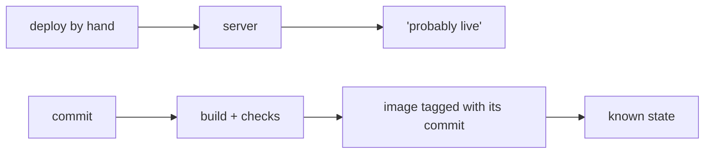
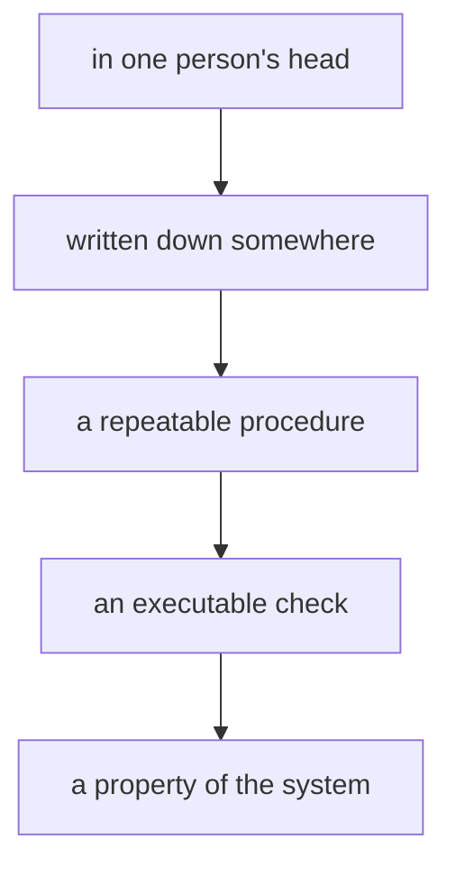

> **TL;DR:** *"Is it live?"* used to be a question for whoever last touched the server. These days I use CI for more than builds: it's where mechanical decisions go once I'm tired of depending on somebody to remember them. The hard part is knowing which decisions belong there and which ones still need a person.

*"Is it live?"*

For a good chunk of my career the honest answer was somebody's memory. Deploys went out by hand: connect, upload, hope. If the person who'd done it had gone home, you read file timestamps and drew your own conclusions. The uploading was never the annoying part. Three minutes, a few times a week, nobody ever put it on a planning board. The annoying part was that a simple question about a running system could only be answered by a human, and only if that human remembered correctly.



That's the pattern I keep coming back to, in my own projects and in fifteen years of other people's. Not "this is inefficient". More like: this fact exists, the system could hold it, and instead it lives in a person who is currently on a train.

## Making the deploy boring

My site is two runtimes over one `content/` directory: an Eleventy build served by Caddy, and a Go TUI you can [reach over SSH](/blog/terminal-over-ssh/). Every push to `main` builds both as images, and a deploy job then resets the server's checkout, pulls and restarts the stack. The pipeline is a file in the repository, which means the way this thing gets deployed is readable by whoever opens the repo next, including me in two years.

Each image gets two tags: `latest`, and the commit SHA that produced it. The second one is the part that matters, because "what's actually running?" becomes a lookup rather than an interview.

I'll be honest about the gap, since it's a good example of how these things really go. My compose file still pulls `:latest`, while the base images in both Dockerfiles are pinned by digest. Third-party code is nailed down harder than my own, and there's exactly one place left where the running version is a moving target. The SHA tag exists, the discipline to consume it doesn't yet.

## Then the pipeline started remembering other things

If deployment were all CI did, it would be a slightly grand `rsync`. What makes it genuinely useful is that a pipeline is a decent place to keep decisions.

```text
push to main
├── build images (web, tui)
├── content: posters + og twins exist?
├── consistency: cv, keybindings
├── architecture: layer rules still true?
├── tests + keyboard harnesses
└── deploy  ← only runs if all of the above pass
```

Only one of those is a build. The rest are rules I got tired of repeating in code review.

**Release-only checks.** Every post here needs a `.webp` poster and a `.jpg` twin for the `ogImage`, because LinkedIn's crawler renders WebP previews unreliably and a post with only WebP art ships with no preview at all. The interesting decision wasn't whether to check, it was where. The obvious home is the build, and that's wrong: I write posts over several evenings and for most of that time the art doesn't exist, so a build that refuses to run until I've made a poster punishes the version of me who's drafting in order to protect the version of me who's publishing. Different days, and only one of them has a deadline. So it runs as its own job, gating the release and nothing else, and it prints the command that fixes it.

**Consistency checks.** A keyboard shortcut's meaning genuinely lives in three places here: the web keymap, the TUI's key table, and the JSON file whose prose both runtimes show the reader. Three representations of one decision, none of which can see the others. I didn't write a checker because it felt tidy; I wrote one because it had already gone wrong. The TUI's old help table announced *"esc / h / q → back"* while `q` on the home screen quit outright, and an accessibility decision about single-character shortcuts was being re-derived at eight callsites with one of them wrong. Nothing else in the repo could see either bug, because being careful in three files at once is exactly what people are bad at.

**Architecture checks.** The nastiest one. The keyboard and overlay layers got centralised because thirteen independent `keydown` listeners had grown up in parallel, each re-deriving "may I handle this key right now?" and each getting it subtly differently. That refactor was the easy half; the hard half is that the same thing grows back. So a check enforces the shape now: global listeners only in four named files, each named with the reason it's allowed. "Please remember our convention" and "the repository knows this is a convention" are not the same sentence, and only one of them survives a busy Thursday and a new contributor.

**Rules I deliberately didn't encode.** One rule in the same contract says *wiring composes, it never accumulates domain data*. Real rule, genuinely important, and every mechanical approximation I tried flagged legitimate code. A check that cries wolf gets commented out within a month, taking the good checks next to it along for the ride. That one stays a review rule.

Not everything that fails should stop a release either. The vulnerability scan reports on every push without gating deploy, and the keybinding check only warns when the *wording* differs rather than the keys. A new advisory in a transitive dependency is worth knowing on Tuesday morning and isn't worth blocking a typo fix at midnight. Handing out vetoes freely is how a team learns to click "merge anyway".

## The same problem, without the YAML

None of this is really about pipelines. Every team I've worked with has a handful of facts that only exist inside somebody, and they follow a fairly predictable path out:



Not every rule should travel the whole way. Plenty stop at "written down" because judgement is the point, and forcing those into a script is how you get software enforcing nonsense with great reliability. But the mechanical ones keep getting stuck two steps short, and you can spot them by the questions people ask each other.

Manual deployments are the obvious one, and they're everywhere: a release goes out, and the only record is in the head of whoever did it, plus a message in a channel that scrolled away. Onboarding is the same shape one layer up. On most projects I've joined, the knowledge required to get running existed, was accurate, and lived in one developer, which works beautifully until they're on holiday during a new joiner's first week. A README helps. A script that provisions the thing can help more, because at least its assumptions get exercised every time somebody runs it.

Then there's the family of checks people do because the system won't say anything about itself. Is this deployed? Which version is on staging? Did the import run last night? Has this form been broken since Friday? Every one of those is a fact a system could publish and doesn't, so a human checks it manually, at intervals they invented, and occasionally forgets. That's not a discipline problem, it's a design decision nobody made on purpose.

The one I have the least patience for is the release status that gets copied by hand. A deploy happens in one system, somebody moves that fact into the project tracker, somebody else relays it to the client. Three systems, one fact, two humans employed as transport. Support does the same job in reverse, reading two screens and a chat thread to answer one question. People make poor middleware, and the fix is rarely clever: publish the state once and let everyone look at the same thing.

What's worth defending is the line between that transport and actual judgement.

```text
machine                    human

asset exists?              does this change make sense?
definitions drifted?       is this risk acceptable?
tests passed?              what does the client need to know?
```

Moving a fact between systems is transport, and a poor use of a person. Explaining what a change means for somebody's business, deciding which risk is acceptable, noticing that a number looks odd: that's where a human belongs, and automating it because you technically can is how you end up with an efficient pipeline producing reports nobody reads. Telling the two apart is the actual skill, and it isn't always obvious which is which.

## Documentation is where rules go to become suggestions

I'm not anti-documentation, and I'd be a hypocrite if I were: one of my own checks fails the build when a feature directory has no README. A README is where rationale goes. Why this layer exists, what we tried first, which trade-off we accepted, what you should think about before changing it. No script can supply that.

CI gets the mechanical half, and the property I want from it is the one I've [argued for elsewhere](/blog/four-things-to-run-a-machine/): exit code equals truth, no negotiation afterwards. In my experience a rule a machine could verify and doesn't gets followed religiously for a while, then inconsistently, then rediscovered in a review by somebody quoting a document last opened in 2022.

## The bad version, which I'm well qualified to build

None of this made anything simpler. It moved the complexity out of people's habits and into a pipeline I now maintain, and that's usually the right trade, but it is a trade. Deciding where complexity sits is most of what architecture actually is. The question isn't "is this simpler?" but "who's carrying it now?"

Get that wrong and you build the other thing. I like building tools, which is precisely the problem: it's very easy to spend four hours removing a two-minute irritation and file it under leverage. Naturally, the script then needed a configuration file. After that it needed a short README. It's now a small internal product with exactly one user, and that user is on holiday next week. Most agencies have three of these, and each one is somebody's pet.

The subtler failure is that automating a step can remove the only occasion anybody had to notice something was wrong. Sometimes a manual review matters because it forces a human to look at the thing. Sometimes writing the weekly update is useful because writing it makes somebody think about the status instead of reporting it. Take the writing away and the thinking goes quietly with it, while the dashboard stays green. Lisanne Bainbridge made this argument about industrial control rooms in 1983 in [*Ironies of Automation*](https://gwern.net/doc/sociology/technology/1983-bainbridge.pdf): automate the routine work and you remove the practice that kept an operator fluent, then leave them responsible for the rare emergency that needs the most skill. The uncomfortable half of that maps onto software delivery pretty easily.

Which is why a green check deserves less credit than it gets. It tells you a process exited, which is [the same trap](/blog/terminal-agent-workbench/) I keep meeting on the review side of the fence. That's the entire claim it makes, and it'll keep making it long after the thinking has left the building.

## Whose day does this actually make easier?

That's the question I ask before building any of it, and the answer has to be a person doing something on a specific afternoon. Not "engineering", not "the team".

The poster check is for me at eleven at night, drafting without art, and for the version of me publishing three weeks later who would otherwise ship a broken preview. The consistency check is for the reader who pressed `q` expecting to go back. The architecture check is for whoever inherits this repo in March and will add a keydown listener in perfectly good faith. The SHA on the image is for whoever is trying to work out what's running, quite possibly me, at an unreasonable hour.

Each one names something a person no longer has to remember, reconstruct, transport or guess. When I can't name that person, I've usually just been handed a solution and asked to build it faster.

## So, is it live?

Fifteen years ago that was a question for whoever had uploaded the files, and the answer was somewhere between "probably" and "let me check the timestamps". Now the pipeline answers it, or answers it as well as my remaining `:latest` tag allows, which is a sentence I should turn into a commit rather than a paragraph.

That's mostly what I want from CI: not more YAML, and definitely not a platform. Fewer facts that are only true because somebody remembered them.

---

*Reference: Lisanne Bainbridge, ["Ironies of Automation"](https://gwern.net/doc/sociology/technology/1983-bainbridge.pdf), Automatica 19(6), 1983. The pipeline and the checks described here are in [the repo for this site](https://github.com/monkeymonk/stephan.zych.be).*
