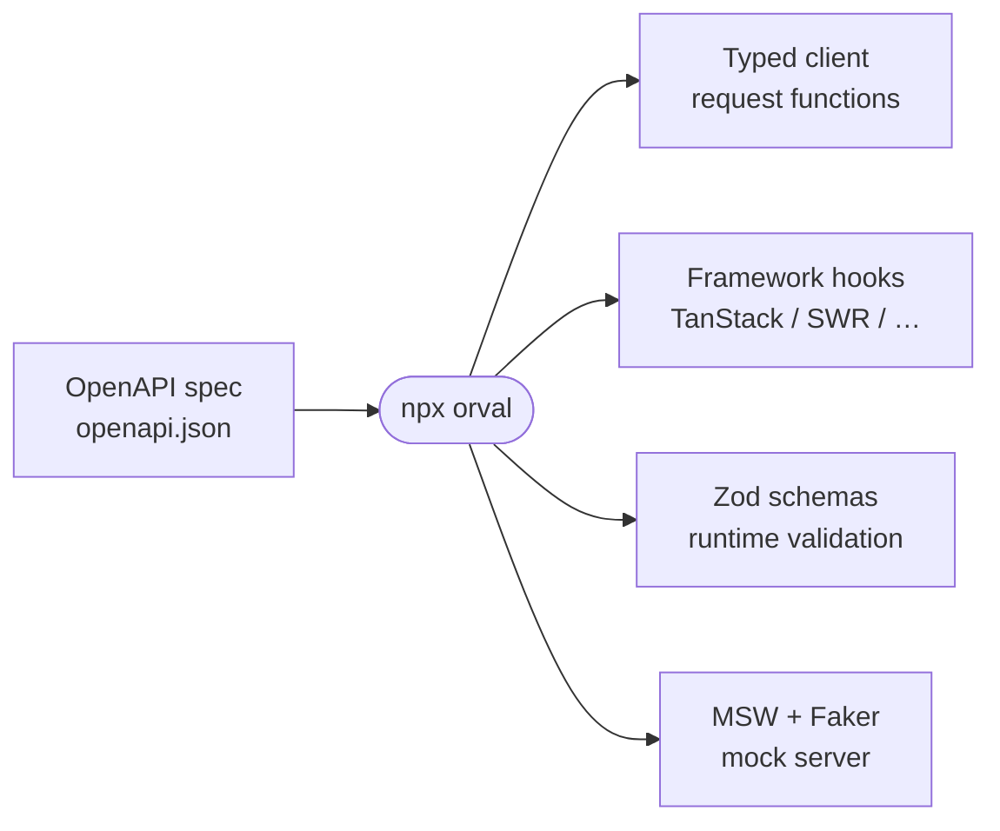

> **TL;DR** — The hand-written API client is the code most likely to lie: it rots the moment the backend changes. Your backend already emits an **OpenAPI** spec — point [**Orval**](https://orval.dev/) at it and get a fully-typed client, framework-native query hooks, Zod validators, and mock servers, regenerated on every spec change. Stop maintaining the frontend's copy of the backend by hand.

Here's a confession that should embarrass a frontend architect: for years, the most error-prone code I shipped was the part where I *described the backend to the frontend*. A folder of hand-written `types.ts`, a wrapper around `fetch`, a `User` interface that said `email: string` while the API had quietly started returning `email: string | null` three sprints ago. Nobody updates that file. It rots. And TypeScript happily compiles your confident lie right up until production returns `null` and the whole card explodes.

The fix isn't discipline. I've tried discipline. The fix is to **stop writing that file by hand**, and let the backend's own contract generate it. That's the entire pitch of [Orval](https://orval.dev/), and it's quietly become the first thing I install on any project with a real API.

## The contract already exists — you're just ignoring it

Every serious backend framework can emit an **[OpenAPI](https://www.openapis.org/) document**: a machine-readable description of every endpoint, every parameter, every request body, every response shape, every enum. It's JSON or YAML, it's versioned, and your backend can produce it automatically from the code that's *already there*.

That document is the contract. The problem has never been that the contract doesn't exist — it's that historically the frontend re-implemented it by hand, in a second language, and the two drifted the moment anyone shipped. OpenAPI is the shared source of truth sitting right there. Orval is the thing that reads it and writes the frontend half *for* you.

## What Orval actually generates

Point it at a spec — a URL, a local `openapi.json`, whatever — and it emits a typed TypeScript client. But "typed client" undersells it. Out of one spec you get, optionally, all of this:

- **Fully-typed request functions** for every endpoint. Wrong param, wrong body shape, renamed field — it's a red squiggle at compile time, not a 2am Sentry alert.
- **Framework-native data hooks.** It generates idiomatic [TanStack Query](https://tanstack.com/query) (`react-query`), SWR, Vue Query, Svelte Query, Solid Query, or Angular code — one hook per endpoint. A `useListPets()` and `useGetPetById()` that already know their own types, caching keys, and error shapes.
- **[Zod](https://zod.dev/) schemas** for runtime validation, so the boundary where data actually enters your app is checked against the spec — closing the gap between "TypeScript thinks this is a `User`" and "the network actually sent a `User`."
- **[MSW](https://mswjs.io/) mock handlers stuffed with [Faker](https://fakerjs.dev/) data.** This is the one that converts people. Orval reads the spec and generates a fake server — realistic-looking responses for every endpoint — so the frontend can be built and tested against an API that *the backend team hasn't written yet*. No more blocking on each other. The spec is the handshake; both sides build against it in parallel.

One spec fans out into every artifact you'd otherwise hand-maintain:



The config is a single file and reads about how you'd hope:

```ts
// orval.config.ts
import { defineConfig } from 'orval';

export default defineConfig({
  api: {
    input: 'https://api.example.com/openapi.json',
    output: {
      mode: 'tags-split',          // one folder per API tag, not one 9000-line file
      target: 'src/api/generated',
      client: 'react-query',
      mock: true,                  // emit the MSW handlers too
      override: {
        mutator: { path: 'src/api/http.ts', name: 'http' }, // your own axios/fetch instance
      },
    },
  },
});
```

Then the loop is just: backend ships a spec change → you run `npx orval` → TypeScript lights up everywhere the contract moved → you fix the UI with the compiler holding your hand. Wire it into CI and a stale client becomes a *failing build* instead of a runtime surprise. Using the API looks like this, and it's the same in every component:

```ts
const { data, isLoading, error } = useListPets({ status: 'available' });
//      ^? Pet[]   — fully typed, all the way down, generated, never hand-edited
```

## The part I actually want to sell you: it doesn't care about your backend

This is where it stops being "a nice React tool" and starts being an *architecture* decision. Orval consumes OpenAPI. It does not know, and does not care, what produced it. The spec is a neutral interchange format — so the exact same frontend codegen pipeline rides on top of completely different stacks. I've now done all three.

**Laravel.** The PHP side of my world. You don't write OpenAPI by hand — you let [Scramble](https://scramble.dedoc.co/) infer it straight from your controllers, form requests, and API resources (no annotations, it reads your types), or [Scribe](https://scribe.knuckles.wtf/) if you want the annotated route. Either way you get an `openapi.json` Orval can eat:

```bash
php artisan scramble:export   # → openapi.json, straight from your existing code
```

**Django / Wagtail.** A Django REST Framework API with [drf-spectacular](https://drf-spectacular.readthedocs.io/) generates a clean OpenAPI 3 doc from your serializers and viewsets. Wagtail's headless setups lean on the same DRF layer — or [Django Ninja](https://django-ninja.dev/), which is Pydantic-typed end to end and emits OpenAPI by default. Point Orval at the result and your Python models become typed React hooks:

```bash
./manage.py spectacular --file openapi.yml
```

**Next.js / Node.** [NestJS](https://docs.nestjs.com/openapi/introduction) builds the spec from decorators; [Fastify](https://github.com/fastify/fastify-swagger) and [Hono's zod-openapi](https://hono.dev/examples/zod-openapi) derive it from your Zod schemas so the runtime validation *is* the documentation. Even when the whole stack is TypeScript, codegen still earns its place: it guarantees the client matches the server's published contract rather than whatever you remembered the server doing.

Three languages, three ORMs, three ecosystems — **one frontend pipeline.** That's the thing worth internalising. When I move between a Laravel client, a Wagtail headless build, and a Node service, the API layer of the React app is *identical in shape*: a generated folder, a `react-query` hook per endpoint, MSW mocks for tests. The backend is an implementation detail behind a spec. My frontend conventions stop being per-project folklore and become a repeatable boilerplate — which, if you've read my [whoami](/whoami/), is more or less my entire personality.

## The honest tradeoffs

It's not free, and I'd be selling you something if I pretended otherwise:

- **It's overkill for a weekend prototype.** Three endpoints and a `fetch` is fine. Reach for this when there's a real contract, a real team, and a real cost to drift.
- **You inherit a runtime dependency and a generated folder** in your repo. Generated code is still code; check it in, review the diffs, treat `npx orval` as a build step with an owner.
- **Heavy type inference can tax the IDE** on large specs, and the generated TanStack hooks bury some response handling in the library, so a weird bug occasionally means reading generated code. Annoying. Still cheaper than the bug it prevents.

None of that outweighs the core win. Frontend–backend drift isn't a tooling annoyance, it's a **broken contract** — two teams disagreeing about reality and finding out in production. Orval makes the spec the single source of truth and turns it into living, typed, mockable frontend code that resynchronises with one command.

I write a lot of opinions about build tooling. This is one of the few that's just *correct*: stop hand-writing the thing a machine can derive from a document your backend already publishes. Let the spec write the client.

---

*References: [Orval docs](https://orval.dev/) · [orval on npm](https://www.npmjs.com/package/orval) · [orval-labs/orval](https://github.com/orval-labs/orval) · spec generators [Scramble](https://scramble.dedoc.co/), [drf-spectacular](https://drf-spectacular.readthedocs.io/), and [NestJS Swagger](https://docs.nestjs.com/openapi/introduction).*
