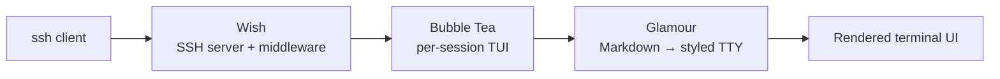

> **TL;DR** — My site was already a browser terminal, so I built the real one too: `ssh stephan.zych.be` serves the same About, Projects, and Blog over SSH — no browser, no JavaScript. It's a short Go stack on [Charm](https://charm.sh/)'s toolkit — Wish (SSH server), Bubble Tea (TUI), Glamour (Markdown) — reading the exact same `content/` the website does.

The website you're reading is a terminal cosplaying as a browser. Catppuccin, JetBrains Mono, a `:` command palette — the whole bit. It was only a matter of time before someone asked the obvious question: *if it looks like a terminal, why can't I just SSH into it?*

So now you can:

```bash
ssh stephan.zych.be
```

No browser. No JavaScript. No web fonts pretending to be a TTY. Just a Go program piped down an SSH connection, rendering the exact same About, Projects, and Blog you're looking at right now — except this time the terminal is real.


## Stealing the idea, honestly

I'd love to claim originality. I can't.

[ThePrimeagen](https://www.youtube.com/c/theprimeagen) has been beating the "the terminal is the best UI you'll ever ship" drum for years, and at some point it stops being a meme and starts being a design brief. Then [terminal.shop](https://www.terminal.shop/) showed up and sold actual coffee through `ssh terminal.shop` — a real storefront, real checkout, zero pixels. That's the kind of unreasonable commitment to a joke I respect, because the joke turns out to be load-bearing: SSH is a battle-tested, encrypted, universally installed application protocol, and we mostly use it to type `git pull`.

A personal site is a lower-stakes target than a payment flow, which made it the perfect excuse to find out how the trick works.

## The stack is suspiciously short

The whole thing is [Charm](https://charm.sh/)'s toolkit doing the heavy lifting:

- **[Wish](https://github.com/charmbracelet/wish)** — an SSH server you compose out of middleware, the same way you'd build an HTTP handler chain.
- **[Bubble Tea](https://github.com/charmbracelet/bubbletea)** — the Elm-architecture TUI framework (`Model`, `Update`, `View`) that renders the actual interface.
- **[Glamour](https://github.com/charmbracelet/glamour)** — Markdown → styled terminal output, so my blog posts render in the TUI without a second content pipeline.

Stacked up, the connection flows straight through Charm's toolkit:



Wish's whole pitch is that an SSH session is *just another way to hand a user a terminal*. Bubble Tea already renders to a terminal. So you bolt one onto the other, and the same `Model` that runs locally suddenly runs for anyone on the internet with an `ssh` client. Which is everyone.

```go
s, err := wish.NewServer(
    wish.WithAddress(net.JoinHostPort(host, port)),
    wish.WithHostKeyPath(hostKey),
    wish.WithMiddleware(
        bm.Middleware(teaHandler),    // hand each session a Bubble Tea program
        activeterm.Middleware(),      // reject anything that isn't a real TTY
        lm.Middleware(),              // log connections
    ),
)
```

That's the server. The interesting line is `bm.Middleware(teaHandler)`: every incoming SSH session gets its own Bubble Tea program, sized to *their* window, running *their* event loop. A hundred people can connect and each gets an isolated TUI. The middleware stack reads bottom-to-top like any good onion, and `activeterm` quietly slams the door on bots and scripted pokes that don't bring an interactive terminal.

## One terminal, sized to your window

The handler that runs per connection is where the SSH-specific reality leaks in — you have to ask the client how big its terminal is, because there's no viewport to measure:

```go
teaHandler := func(s ssh.Session) (tea.Model, []tea.ProgramOption) {
    pty, _, active := s.Pty()
    w, h := 80, 24
    if active {
        w, h = pty.Window.Width, pty.Window.Height
    }
    // ...build the model at that size
    return NewModel(c, d, err, w, h), []tea.ProgramOption{tea.WithAltScreen()}
}
```

`80×24` is the fallback because of course it is — that's the size of a VT100, and we are apparently never escaping 1978. `tea.WithAltScreen()` flips into the alternate screen buffer, the same one `vim` and `htop` use, so when you disconnect your scrollback is exactly where you left it instead of buried under my ASCII wordmark.

## The part I'm actually smug about: one source of truth

Here's the rule I refused to break: **I am not writing my bio twice.**

The web build (Eleventy + Lit web components) and the SSH build (Go + Bubble Tea) are completely different runtimes that share zero code. The thing they *do* share is a directory — `content/` — full of Markdown and JSON. The website reads it at build time. The TUI reads it at connection time:

```go
// Reload content per session so deploys without a restart still serve
// fresh data; fall back to the boot-time copy on error.
c, err := LoadContent(contentDir)
if err != nil {
    c, err = content, loadErr
}
```

That per-session reload is a small thing that buys a lot: I can edit a project, redeploy the content, and the *next* SSH connection sees it without bouncing the server or dropping anyone mid-session. The web and the terminal stay in lockstep because neither owns the content — the `content/` directory does. Two renderers, one set of facts. Edit once, ship to both.


## Where it actually lives

A demo on your laptop is one thing; a public SSH port is another. This runs in a **distroless** container — a base image with no shell, no package manager, no busybox, *nothing* but the compiled Go binary. If someone ever found a hole in the TUI, there's no `/bin/sh` waiting on the other side to pivot into. The binary runs as a non-root user, on a read-only root filesystem, with every Linux capability dropped.

The port is the one trick worth spelling out. You can't put a normal reverse proxy in front of SSH: Caddy, Traefik, and friends route by TLS SNI, and **SSH has no SNI** — there's no hostname in the handshake to switch on. So there's no L7 proxy here. The container listens on an unprivileged `2222` (binding `:22` would mean running as root, no thanks), and Docker publishes it to the host's port 22 directly:

```yaml
ports:
  - "22:2222"
```

The only catch: the box's *own* sshd has to move off 22 first, or the two fight over the port. Admin SSH lives on some other number now, firewalled; port 22 belongs to the site.

The same box serves the website too — a tiny Caddy container next to the TUI, both reading the same `content/` directory, fronted by one domain with automatic HTTPS. (The website could just as happily live on a CDN like GitHub Pages; I went one-box because the SSH server already needed a home and I like deploying the whole thing with a single `docker compose up`.)

The tedious-but-load-bearing details the demos skip:

- **Host keys are your identity — treat them like it.** The server presents a host key on every connection; regenerate it casually and every visitor gets the `REMOTE HOST IDENTIFICATION HAS CHANGED` wall of fear. It's generated once and persisted in a volume, never rotated on a whim.
- **A public SSH server is an abuse magnet.** Idle sessions get dropped, every session has an absolute time cap, and there's a ceiling on concurrent connections — so one bored script can't hold the door open forever or fork-bomb the box.
- **A session can do exactly one thing: look at my CV.** No shell, no auth, no file access. `activeterm` rejects anything that isn't a real interactive terminal, and a Bubble Tea program is the *entire* surface area. It's still an open port on the internet, and you build it like one.

## Go on, then

It's live. Same content, half the dependencies, none of the browser:

```bash
ssh stephan.zych.be
```

Or, if you're already in here clicking around like it's 2010, press <kbd>:</kbd> and run `ssh` — it'll copy the command for you. Then go open a real terminal and see the other half of the joke.

---

*Same content, half the dependencies, none of the browser — `ssh stephan.zych.be`.*
