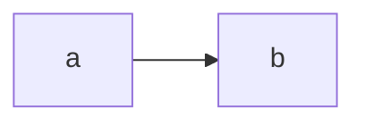

# Mermaid Feature

Lazy Mermaid renderer. The `mermaid` package is heavy, so it is only imported
when a page actually contains a `<pre class="mermaid">` block (emitted from
` ```mermaid ` fences by the markdown pipeline). esbuild code-splitting puts it
in its own chunk, kept out of the main bundle.

No custom element: the feature is one function, called by `app/index.ts` on
load and after each SPA navigation.

## API

### `initMermaid(): Promise<void>`
Renders every `pre.mermaid:not([data-processed])` on the current page. Safe to
call repeatedly — mermaid marks the nodes it has handled, so only
freshly-swapped diagrams are rendered.

Theme variables are read from the live `--sz-*` custom properties, with a
hardcoded Catppuccin fallback for the case where the theme stylesheet has not
applied yet. `securityLevel: 'strict'`, `startOnLoad: false`.

A diagram that fails to render leaves its source visible and logs to the
console.

## Usage
````markdown

````
